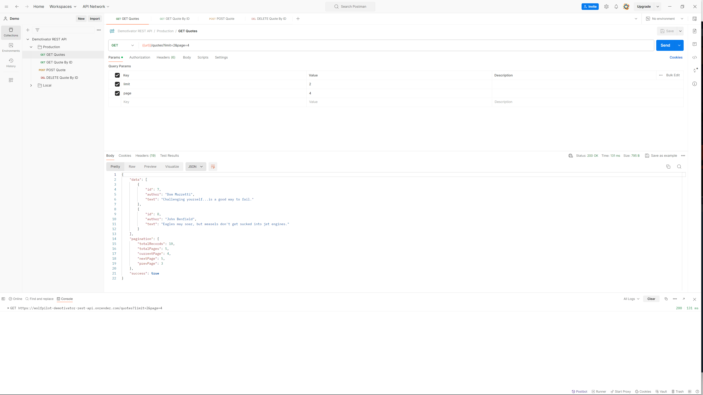

# Demotivator REST API

A _mostly_ complete example of an Express server with PostgreSQL db and a bunch of other features sprinkled on top.

## Table of contents

- [Demotivator REST API](#demotivator-rest-api)
  - [Table of contents](#table-of-contents)
  - [General info](#general-info)
  - [Demo](#demo)
  - [Features (done)](#features-done)
  - [Features (TBA)](#features-tba)
  - [Technologies](#technologies)
  - [API](#api)
  - [Security](#security)
  - [Getting started](#getting-started)
  - [Workflow (personal notes)](#workflow-personal-notes)
  - [Resources](#resources)
  - [License](#license)

## General info

_Why do today what you can put off until tomorrow?_

It's a joke, of course, don't take it too seriously.

The whole idea behind this was to get my hands dirty with setting up APIs: best practices, scaling, maintenance and security vulnerabilities.

## Demo

Endpoints

- All quotes: [https://wolfpilot-demotivator-rest-api.herokuapp.com/quotes](https://wolfpilot-demotivator-rest-api.herokuapp.com/quotes)
- Single quote: [https://wolfpilot-demotivator-rest-api.herokuapp.com/quotes/5](https://wolfpilot-demotivator-rest-api.herokuapp.com/quotes/5)

Postman



## Features (done)

- Architecture

  - MVC
  - RESTful API
  - CRUD

- Middleware

  - Debug console logger
  - Request and error loggers with daily rotated files
  - Request body content type validation
  - Schema-based error validation

- Config

  - Automated seeding from .sql files
  - Import path aliases using tsconfig-paths
  - Localised .env files using dotenv-flow

## Features (TBA)

- \[ ] Naughty SQL keyword detection (DROP TABLE, template0/1, etc.)
- \[ ] Prepared statements (security)
- \[ ] Request throttling (rate limitting, CAPTCHA)
- \[ ] Response document pagination (cursor)
- \[ ] Protected routes (not necessary atm.)

## Technologies

- Languages
  - [TypeScript](https://www.typescriptlang.org/)
  - SQL ([PostgreSQL](https://www.postgresql.org/docs/9.2/sql-syntax.html))
- Server
  - [Node.js](https://nodejs.org/)
  - [Express](https://expressjs.com/)
- Database
  - [PostgreSQL](https://www.postgresql.org/)
  - Raw SQL (Knex considered)
- Config
  - [tsconfig-paths](https://www.npmjs.com/package/tsconfig-paths)
  - [dotenv-flow](https://www.npmjs.com/package/dotenv-flow)
- Linting & formatting
  - [EsLint](https://eslint.org/)
  - [Prettier](https://prettier.io/)
- Validation
  - [JSON Schema 7](https://json-schema.org/understanding-json-schema/)
- Testing
  - [Jest](https://jestjs.io/)
  - [SuperTest](https://www.npmjs.com/package/supertest)
  - [Postman](https://www.postman.com/)
- Logging
  - [Winston](https://www.npmjs.com/package/winston)
- CI/CD
  - [Husky](https://www.npmjs.com/package/husky)
    - Pre-commit
    - Pre-push
  - [Heroku](https://www.heroku.com/)
    - Hosting server and DB

## API

Either start your own server and visit [http://localhost:9000](http://localhost:9000) or [https://wolfpilot-demotivator-rest-api.herokuapp.com](https://wolfpilot-demotivator-rest-api.herokuapp.com).

### Endpoints

```
# Quotes
  GET    /quotes     - fetch all quotes
  POST   /quotes     - create new quote
  GET    /quotes/:id - fetch single quote
  DELETE /quotes/:id - delete single quote
```

### Examples

```bash
# Create a new quote
curl \
  -H 'Content-Type: application/json' \
  -X POST \
  -d '{
    "author": "Steven Wright",
    "text":"The light at the end of the tunnel has been turned off due to budget cuts."
  }' \
  https://wolfpilot-demotivator-rest-api.herokuapp.com/quotes

# Delete a quote
curl \
  -X DELETE \
  https://wolfpilot-demotivator-rest-api.herokuapp.com/quotes/5
```

## Security

Although several precautions have been taken such as restricting user privileges (no "superuser" or "create role"), validating requests (ex: checking that ID strings only coerce to numbers and that they're higher than 0) and using parameterised queries, there are still plenty of improvements that can be made to a public API such as this.

Other measures that comes to mind are:

- Crepared statements
- Checking payloads for potentially dangerous SQL statements
- Throttling requests to prevent flooding

For the purpose of this exercise however, I will say this is enough. If you want to destroy the 10 rows of data being stored, be my guest, Mr. Robot! Just leave me a nice message afterwards.

## Getting started

### Requirements

- [Node.js](https://nodejs.org/en/)
- [Yarn](https://yarnpkg.com/)
- [PostgreSQL](https://www.postgresql.org/)

Optionally, install [Postico](https://eggerapps.at/postico/) to get a visual on your DB structure, data and execute queries.

### Installation

```bash
$ git clone https://github.com/wolfpilot/demotivator-rest-api.git
$ cd demotivator-rest-api
$ yarn
```

### Steps

```bash
# 1. Update your env config, see .env for guidance.

# 2. Start an instance of PostgreSQL

# 3. Run the API service
$ yarn start:dev
```

## Workflow (personal notes)

PostgreSQL shell commands

```shell
"psql" to connect to your db and user
"\l" to list all databases
"\c db_name" to connect to db_name
"\dt" to inspect tables
"\du+" to see table of users
"\q" to quit
```

Heroku CLI

```bash
# To connect to the db and user
heroku pg:psql

# To pull a database
heroku pg:pull DB_URL local_db_name --app app_name

# To push a database and (optionally) reset first
heroku pg:reset DB_URL --app app_name
heroku pg:push local_db_name DB_URL --app app_name

# To log real-time stream
heroku logs --tail

# To explore the file system (shell)
heroku run bash
```

## Resources

- Demotivational quotes referenced from Beverly Jenkins' [Demotivational Quotes for Pessimists With a Sense of Humor](https://www.liveabout.com/demotivational-quotes-4685738)
- Setup loosely based on Tania Rascia's [Node.js, Express.js, and PostgreSQL: CRUD REST API example](https://blog.logrocket.com/nodejs-expressjs-postgresql-crud-rest-api-example) tutorial
- [REST Resource Naming Guide](https://restfulapi.net/resource-naming/)
- Google Search Console API [standard error messages](https://developers.google.com/webmaster-tools/search-console-api-original/v3/errors)

## License

This project is licensed under the [MIT License](LICENSE).
